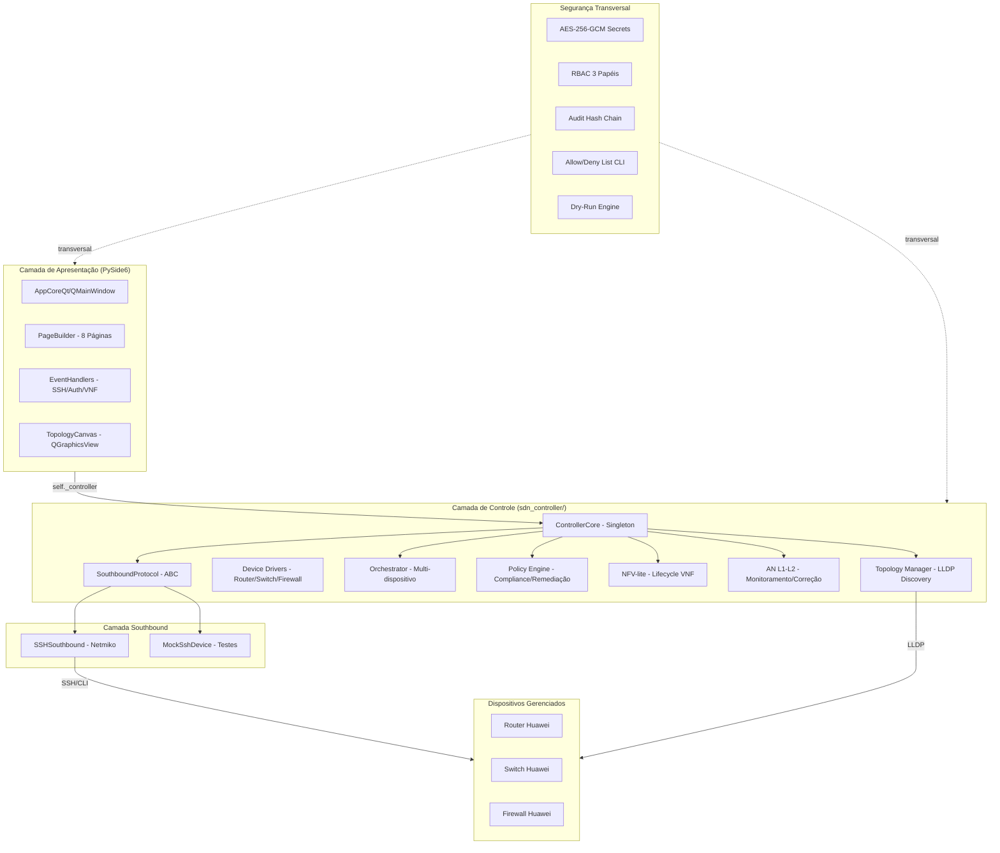
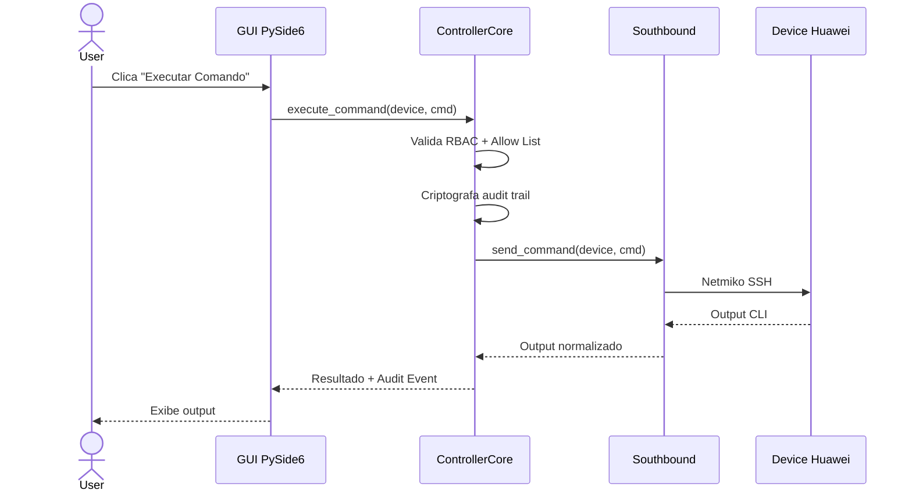

# Arquitetura do Huawei Manager / SDN Controller

## Visão Geral

O Huawei Manager evolui de um simples cliente SSH para um controlador SDN modular,
mantendo PySide6 como interface e SSH/CLI (Netmiko) como protocolo southbound
exclusivo. A arquitetura segue o padrão de **3 camadas** com segurança transversal.

## Diagrama de Camadas

## Fluxo de Dados

## Modelo de Ameaças (STRIDE)

| Tipo | Ameaça | Mitigação |
|------|--------|-----------|
| **S**poofing | Dispositivo falsificado na topologia | Host key verification (TOFU), unknown device detection |
| **T**ampering | Comando CLI adulterado em trânsito | SSH nativo (já cifra o canal), audit hash chain |
| **R**epudiation | Operador nega ter executado comando | Audit trail inviolável (SHA-256 chain), RBAC logging |
| **I**nformation Disclosure | Credenciais expostas em log ou exception | Sanitização automática, logging sem credenciais |
| **D**enial of Service | Múltiplas conexões SSH simultâneas | Rate limiting por device, timeout configurável |
| **E**levation of Privilege | Operador executa ação de admin sem permissão | RBAC 3 papéis, validação em cada operação |

## Camadas da Arquitetura

### 1. Camada de Apresentação (GUI)
- PySide6 (QMainWindow + QStackedWidget + QGraphicsView)
- 8 páginas + TopologyCanvas + Dashboard com auto-refresh
- Responsabilidades: exibir dados, capturar input do usuário, delegar ao controller
- NOTA: a GUI **não contém lógica de domínio** — apenas orquestração de telas

### 2. Camada de Controle (sdn_controller/)
- `ControllerCore` — objeto interno (`self._controller`) dentro de `AppCoreQt`
- Módulos: Southbound Abstration, Device Drivers, Orchestrator, Policy Engine, NFV-lite, AN L1-L2, Topology Manager
- Responsabilidades: toda lógica de negócio, validação, orquestração multi-dispositivo

### 3. Camada Southbound
- `SSHSouthbound` — implementação real via Netmiko
- `MockSshDevice` — substituto para testes offline
- Único protocolo: SSH/CLI (sem NETCONF, OpenFlow, gRPC, REST)
- Retry com backoff, timeout configurável, logging sanitizado

## Decisões Arquiteturais

- **sdn_controller/** como pacote Python interno, não como serviço externo
- **ControllerCore** instanciado como objeto interno em `AppCoreQt.__init__()`
- **Coexistência:** GUI acessa controller via `self._controller`; dentro de `sdn_controller/` o acesso é via `get_controller()` (evita import circular)
- **lldp_discovery.py** em vez de `topology.py` para evitar conflito de nome com o canvas existente (472 linhas)
- **ADR 004** documenta a estratégia de integração em detalhes
